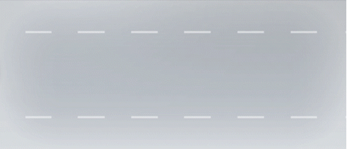

# Term Project For CMPE486 Simulation Based Testing of Autonomous Systems

This project is about creating tests with an open-source simulation, Carla. What we investigated in this project is called a cut-out scenario. Three cars are in the same lane. The first car is slower than the other two, and the car in the middle changes lane. The last car is the autonomous one, called Ego. In our tests, we investigate the Ego car's movements to ensure autonomous cars are safe on the roads.

Scenarios are divided into two: straight or curved roads. 25 scenarios are created for each scenario by picking random parameters as target speeds. As follows:

| # | Ego Speed | V1 Speed | V2 Speed |
| - | --------- | -------- | -------- |
| Minimum | 70kph | 70kph | 0kph |
| Maximum | 90kph | 90kph | 20kph |

Maximum lateral accelerations and all lateral accelerations history are saved. Measurements are taken from the vehicle in the middle. Plots can be found from the following links. 

[Straight Road](scenario-1.md)  

[Curved Road](scenario-2.md) 
