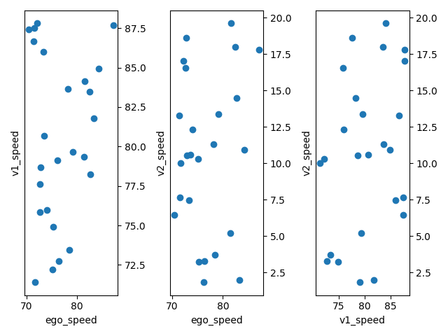
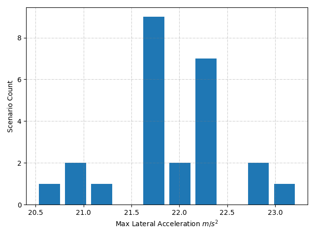
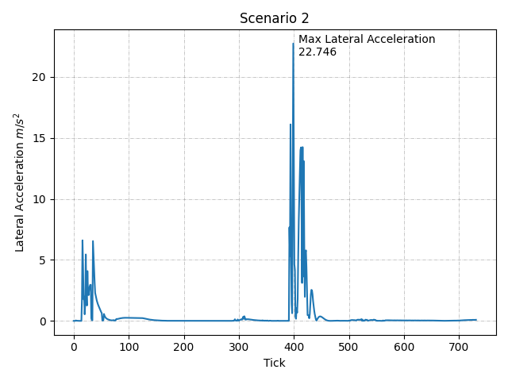
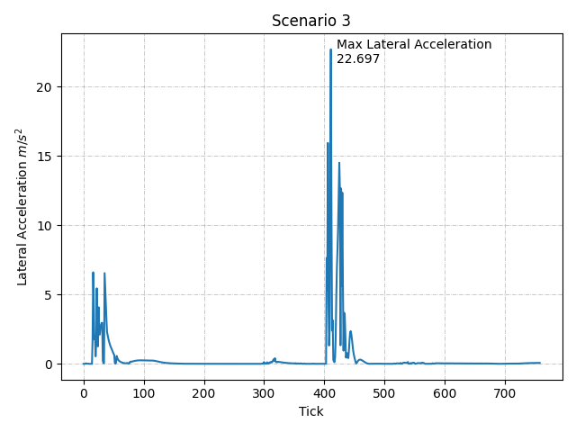
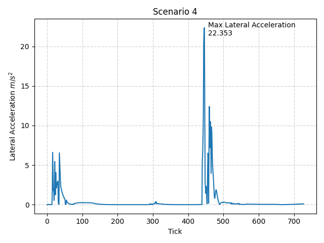

# Test 1

## Scenario Setup

| # | Spawn Point Location | Spawn Point Rotation | Target Speed |
| - | --------- | -------- | -------- |
| Hero | (-400, 37.8, 0.28) | (0, -0.368408, 0) | 70-90 km/h |
| Other1 | (342, 37.8, 0.28) | (0, -0.368408, 0) | 70-90 km/h |
| Other2 | (0.147202, 37.8, 11.213045 ) | (-1.188200, 0.977946, -0.179993) | 0-20 km/h |

## Test Results

- #### Target Speeds
    
- #### Max Lateral Accelerations
    
- #### Lateral Acceleration History 
    
    
    
    
    