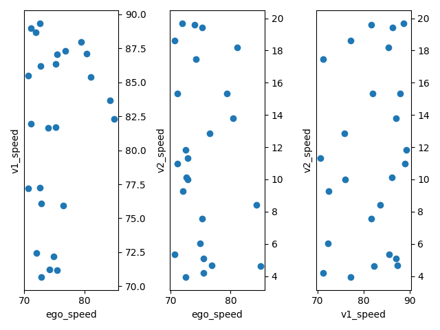
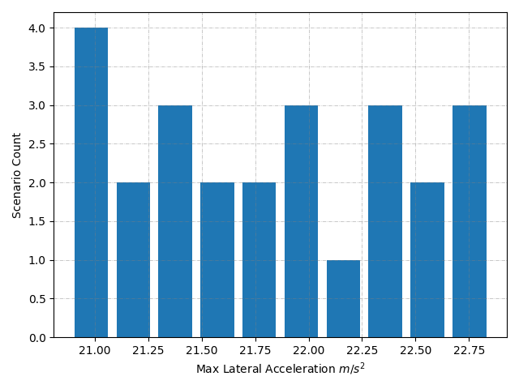
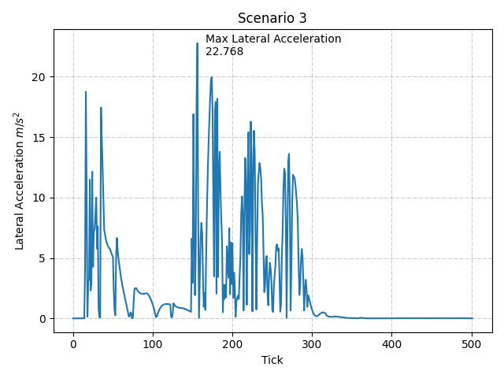
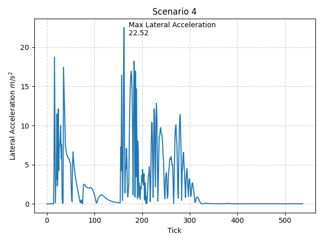

# Test 2

## Scenario Setup

| # | Spawn Point Location | Spawn Point Rotation | Target Speed |
| - | --------- | -------- | -------- |
| Hero | (-483, 270, 1) | (0, -89.642479, 0) | 70-90 km/h |
| Other1 | (-487, 211,  0.281942) | (0, -89.642479, 0) | 70-90 km/h |
| Other2 | (-485.740143, 90, 0.281942) | (0, -89.642479, 0) | 0-20 km/h |

      
## Test Requirements

## Test Results

- #### Target Speeds
    
- #### Max Lateral Accelerations
    
- #### Lateral Acceleration History 
    
    
    
    
    